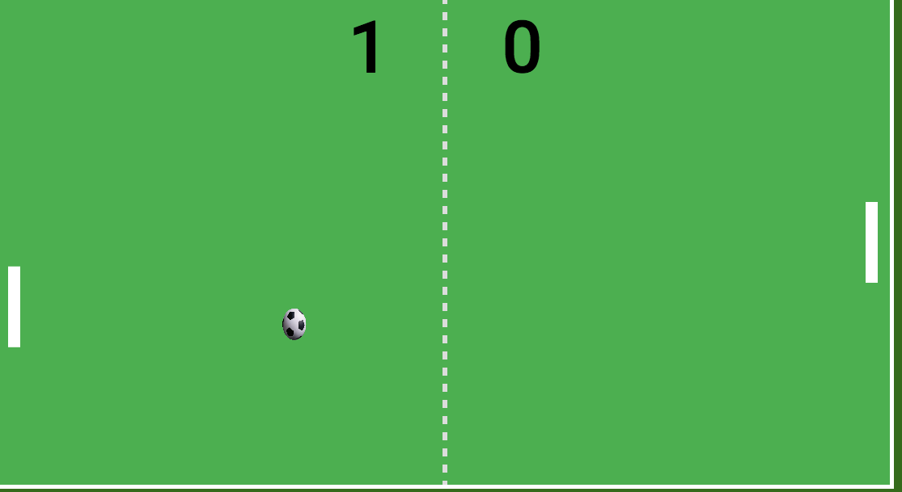

# Goal

[GOAL live][git]

[git]: https://tonyhliu.github.io/goal/

Inspired by Atari's PONG, Goal is a 2D Javascript game, a showpiece for Javascript & HTML5 Canvas.

## Features

- Play against the AI, first to 7 points wins
- Sound effects when game begins and when point is scored

## Future Implementations

Goal is only barely considered an MVP. The game was implemented in 3 days. The features that could be added in the future would be the option to choose
between playing against the AI or against a human player and the option to choose the difficulty of the AI.
